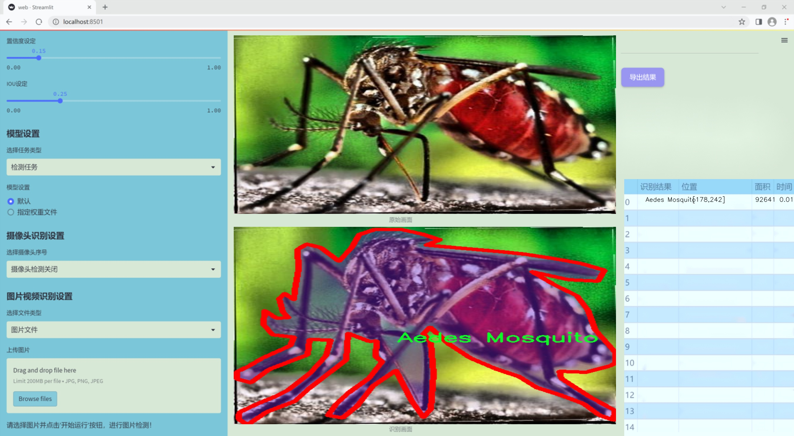

### 1.背景意义

### 研究背景与意义

随着全球气候变化和人类活动的加剧，害虫的种类和数量不断增加，给农业、生态环境和公共卫生带来了严重威胁。害虫不仅会直接损害农作物，导致经济损失，还可能传播疾病，影响人类健康。因此，及时准确地识别和分类害虫成为了农业管理和生态保护中的一项重要任务。传统的害虫识别方法依赖于专家的经验和人工观察，效率低下且容易受到主观因素的影响，难以满足现代农业和生态监测的需求。

近年来，计算机视觉技术的快速发展为害虫识别提供了新的解决方案。基于深度学习的目标检测算法，尤其是YOLO（You Only Look Once）系列，因其高效的实时检测能力和较高的准确率，逐渐成为害虫识别领域的研究热点。YOLOv11作为该系列的最新版本，具备更强的特征提取能力和更快的处理速度，能够在复杂环境中实现对多种害虫的快速识别与分类。

本研究旨在基于改进的YOLOv11算法，构建一个高效的害虫识别与分类图像分割系统。该系统将利用一个包含22种害虫的丰富数据集，涵盖了如蚊子、蟑螂、蜜蜂等多种常见害虫。这些害虫不仅在生态系统中扮演着重要角色，也对人类生活产生了深远影响。通过对4857张经过精细标注的图像进行训练，系统将能够实现对不同种类害虫的精准识别与分类，从而为农业管理和生态监测提供有力支持。

此外，本研究还将探讨数据预处理和增强技术对模型性能的影响，力求在提高识别准确率的同时，降低对计算资源的需求。通过建立高效的害虫识别系统，不仅可以为农民提供实时的害虫监测工具，还能为相关科研提供数据支持，推动害虫生态学和防治技术的发展。因此，本研究具有重要的理论价值和实际应用意义。

### 2.视频效果

[2.1 视频效果](https://www.bilibili.com/video/BV1XASPYcEru/)

### 3.图片效果





##### [项目涉及的源码数据来源链接](https://kdocs.cn/l/cszuIiCKVNis)**

注意：本项目提供训练的数据集和训练教程,由于版本持续更新,暂不提供权重文件（best.pt）,请按照6.训练教程进行训练后实现上图演示的效果。

### 4.数据集信息

##### 4.1 本项目数据集类别数＆类别名

nc: 22
names: ['Aedes Mosquito', 'American Cockroach', 'Anopheles Mosquito', 'Asian Longhorned Tick', 'Black House Spider', 'Black Widow Spider', 'Black carpenter ant', 'Brown Dog Tick', 'Bumblebee', 'Carpenter bee', 'Culex Mosquito', 'Deer Tick', 'House Fly', 'Lone Star Tick', 'Moose Tick', 'Relapsing Fever Tick', 'Stag Beetle', 'Western Honey Bee', 'Wolf Spider', 'Wood Tick', 'acrobat ants', 'crazy ants']


该项目为【图像分割】数据集，请在【训练教程和Web端加载模型教程（第三步）】这一步的时候按照【图像分割】部分的教程来训练

##### 4.2 本项目数据集信息介绍

本项目数据集信息介绍

本项目旨在改进YOLOv11的害虫识别与分类图像分割系统，所使用的数据集来源于“Dynamite Duelers Project”，该数据集专注于多种害虫的识别与分类，涵盖了22个不同的类别。这些类别包括了常见的蚊子、蟑螂、蜱虫、蜜蜂及多种蜘蛛等，具体类别有：Aedes蚊子、美国蟑螂、按蚊、亚洲长角蜱、黑屋蜘蛛、黑寡妇蜘蛛、黑木匠蚂蚁、棕色狗蜱、熊蜂、木匠蜂、库勒蚊、鹿蜱、家蝇、孤星蜱、驼鹿蜱、复发热蜱、 stag甲虫、西方蜜蜂、狼蛛、木蜱、杂技蚂蚁和疯狂蚂蚁等。这些害虫在生态系统中扮演着重要的角色，但同时也可能对人类健康和农业生产造成威胁，因此对其进行有效的识别与分类显得尤为重要。

数据集中的图像经过精心挑选，确保了每个类别的样本具有足够的多样性和代表性，涵盖了不同的环境、光照条件和角度，以提高模型的泛化能力。此外，数据集还包含了标注信息，便于训练和验证阶段的图像分割任务。通过利用这一数据集，改进后的YOLOv11模型将能够在实际应用中更准确地识别和分类这些害虫，从而为相关领域的研究和实践提供有力支持。

总之，本项目的数据集不仅为害虫识别与分类提供了丰富的样本资源，也为未来的研究和应用奠定了坚实的基础，期待通过技术的进步，能够更好地服务于生态保护和公共卫生的需求。


### 5.全套项目环境部署视频教程（零基础手把手教学）

[5.1 所需软件PyCharm和Anaconda安装教程（第一步）](https://www.bilibili.com/video/BV1BoC1YCEKi/?spm_id_from=333.999.0.0&vd_source=bc9aec86d164b67a7004b996143742dc)


[5.2 安装Python虚拟环境创建和依赖库安装视频教程（第二步）](https://www.bilibili.com/video/BV1ZoC1YCEBw?spm_id_from=333.788.videopod.sections&vd_source=bc9aec86d164b67a7004b996143742dc)

### 6.改进YOLOv11训练教程和Web_UI前端加载模型教程（零基础手把手教学）

[6.1 改进YOLOv11训练教程和Web_UI前端加载模型教程（第三步）](https://www.bilibili.com/video/BV1BoC1YCEhR?spm_id_from=333.788.videopod.sections&vd_source=bc9aec86d164b67a7004b996143742dc)


按照上面的训练视频教程链接加载项目提供的数据集，运行train.py即可开始训练



     Epoch   gpu_mem       box       obj       cls    labels  img_size
     1/200     20.8G   0.01576   0.01955  0.007536        22      1280: 100%|██████████| 849/849 [14:42<00:00,  1.04s/it]
               Class     Images     Labels          P          R     mAP@.5 mAP@.5:.95: 100%|██████████| 213/213 [01:14<00:00,  2.87it/s]
                 all       3395      17314      0.994      0.957      0.0957      0.0843

     Epoch   gpu_mem       box       obj       cls    labels  img_size
     2/200     20.8G   0.01578   0.01923  0.007006        22      1280: 100%|██████████| 849/849 [14:44<00:00,  1.04s/it]
               Class     Images     Labels          P          R     mAP@.5 mAP@.5:.95: 100%|██████████| 213/213 [01:12<00:00,  2.95it/s]
                 all       3395      17314      0.996      0.956      0.0957      0.0845

     Epoch   gpu_mem       box       obj       cls    labels  img_size
     3/200     20.8G   0.01561    0.0191  0.006895        27      1280: 100%|██████████| 849/849 [10:56<00:00,  1.29it/s]
               Class     Images     Labels          P          R     mAP@.5 mAP@.5:.95: 100%|███████   | 187/213 [00:52<00:00,  4.04it/s]
                 all       3395      17314      0.996      0.957      0.0957      0.0845


###### [项目数据集下载链接](https://kdocs.cn/l/cszuIiCKVNis)

### 7.原始YOLOv11算法讲解

YOLO11采用改进的骨干和颈部架构，增强了特征提取能力，提高了物体检测的精确度和复杂任务的表现。YOLO11引入精炼的架构设计和优化的训练流程，实现更快的处理速度，同时保持精度和性能之间的最佳平衡。通过模型设计的进步，YOLO11m在COCO数据集上实现了更高的均值平均精度（mAP），同时使用比YOLOv8m少22%的参数，使其在不妥协准确性的情况下更加计算高效。YOLO11可以无缝部署在各种环境中，包括边缘设备、云平台以及支持NVIDIA
GPU的系统，确保最大灵活性。无论是物体检测、实例分割、图像分类、姿态估计，还是定向物体检测（OBB），YOLO11都旨在应对多样的计算机视觉挑战。


##### **Ultralytics YOLO11相比于之前版本的主要改进有哪些？**

Ultralytics YOLO11在其前身基础上引入了几项重要进步。主要改进包括：

  1. **增强的特征提取** ：YOLO11采用改进的骨干和颈部架构，增强了特征提取能力，提高了物体检测的精确度。
  2.  **优化的效率和速度** ：精炼的架构设计和优化的训练流程实现了更快的处理速度，同时保持了准确性和性能之间的平衡。
  3.  **更高的准确性与更少的参数** ：YOLO11m在COCO数据集上实现了更高的均值平均精度（mAP），同时使用比YOLOv8m少22%的参数，使其在不妥协准确性的情况下更加计算高效。
  4.  **环境适应性强** ：YOLO11可以在多种环境中部署，包括边缘设备、云平台以及支持NVIDIA GPU的系统。
  5.  **支持广泛的任务** ：YOLO11支持多种计算机视觉任务，如物体检测、实例分割、图像分类、姿态估计和定向物体检测（OBB）。

我们先来看一下其网络结构有什么变化，可以看出，相比较于YOLOv8模型，其将CF2模块改成C3K2，同时在SPPF模块后面添加了一个C2PSA模块，且将YOLOv10的head思想引入到YOLO11的head中，使用深度可分离的方法，减少冗余计算，提高效率。下面我们来详细看一下这两个模块的结构是怎么构成的，以及它们为什么要这样设计


##### C3K2的网络结构

从下面图中我们可以看到，C3K2模块其实就是C2F模块转变出来的，它代码中有一个设置，就是当c3k这个参数为FALSE的时候，C3K2模块就是C2F模块，也就是说它的Bottleneck是普通的Bottleneck；反之当它为true的时候，将Bottleneck模块替换成C3模块。


##### C2PSA的网络结构

` `C2PSA是对 `C2f` 模块的扩展，它结合了PSA(Pointwise Spatial
Attention)块，用于增强特征提取和注意力机制。通过在标准 `C2f` 模块中引入 PSA
块，C2PSA实现了更强大的注意力机制，从而提高了模型对重要特征的捕捉能力。


##### **C2f 模块回顾：**

**** C2f模块是一个更快的 CSP（Cross Stage Partial）瓶颈实现，它通过两个卷积层和多个 Bottleneck
块进行特征提取。相比传统的 CSPNet，C2f 优化了瓶颈层的结构，使得计算速度更快。在 C2f中，`cv1` 是第一个 1x1
卷积，用于减少通道数；`cv2` 是另一个 1x1 卷积，用于恢复输出通道数。而 `n` 是一个包含 Bottleneck 块的数量，用于提取特征。

##### **C2PSA 模块的增强** ：

**C2PSA** 扩展了 C2f，通过引入PSA( **Position-Sensitive Attention)**
，旨在通过多头注意力机制和前馈神经网络来增强特征提取能力。它可以选择性地添加残差结构（shortcut）以优化梯度传播和网络训练效果。同时，使用FFN
可以将输入特征映射到更高维的空间，捕获输入特征的复杂非线性关系，允许模型学习更丰富的特征表示。

##### head部分

YOLO11在head部分的cls分支上使用深度可分离卷积 ，具体代码如下，cv2边界框回归分支，cv3分类分支。

    
    
     self.cv2 = nn.ModuleList(
                nn.Sequential(Conv(x, c2, 3), Conv(c2, c2, 3), nn.Conv2d(c2, 4 * self.reg_max, 1)) for x in ch
            )
            self.cv3 = nn.ModuleList(
                nn.Sequential(
                    nn.Sequential(DWConv(x, x, 3), Conv(x, c3, 1)),
                    nn.Sequential(DWConv(c3, c3, 3), Conv(c3, c3, 1)),
                    nn.Conv2d(c3, self.nc, 1),
                )
                for x in ch
            )


### 8.200+种全套改进YOLOV11创新点原理讲解

#### 8.1 200+种全套改进YOLOV11创新点原理讲解大全

由于篇幅限制，每个创新点的具体原理讲解就不全部展开，具体见下列网址中的改进模块对应项目的技术原理博客网址【Blog】（创新点均为模块化搭建，原理适配YOLOv5~YOLOv11等各种版本）

[改进模块技术原理博客【Blog】网址链接](https://gitee.com/qunmasj/good)


#### 8.2 精选部分改进YOLOV11创新点原理讲解

###### 这里节选部分改进创新点展开原理讲解(完整的改进原理见上图和[改进模块技术原理博客链接](https://gitee.com/qunmasj/good)【如果此小节的图加载失败可以通过CSDN或者Github搜索该博客的标题访问原始博客，原始博客图片显示正常】


借鉴了其他算法的这些设计思想

借鉴了VGG的思想，使用了较多的3×3卷积，在每一次池化操作后，将通道数翻倍；

借鉴了network in network的思想，使用全局平均池化（global average pooling）做预测，并把1×1的卷积核置于3×3的卷积核之间，用来压缩特征；（我没找到这一步体现在哪里）

使用了批归一化层稳定模型训练，加速收敛，并且起到正则化作用。

    以上三点为Darknet19借鉴其他模型的点。Darknet53当然是在继承了Darknet19的这些优点的基础上再新增了下面这些优点的。因此列在了这里

借鉴了ResNet的思想，在网络中大量使用了残差连接，因此网络结构可以设计的很深，并且缓解了训练中梯度消失的问题，使得模型更容易收敛。

使用步长为2的卷积层代替池化层实现降采样。（这一点在经典的Darknet-53上是很明显的，output的长和宽从256降到128，再降低到64，一路降低到8，应该是通过步长为2的卷积层实现的；在YOLOv11的卷积层中也有体现，比如图中我标出的这些位置）

#### 特征融合

模型架构图如下

  Darknet-53的特点可以这样概括：（Conv卷积模块+Residual Block残差块）串行叠加4次

  Conv卷积层+Residual Block残差网络就被称为一个stage


上面红色指出的那个，原始的Darknet-53里面有一层 卷积，在YOLOv11里面，把一层卷积移除了

为什么移除呢？

        原始Darknet-53模型中间加的这个卷积层做了什么？滤波器（卷积核）的个数从 上一个卷积层的512个，先增加到1024个卷积核，然后下一层卷积的卷积核的个数又降低到512个

        移除掉这一层以后，少了1024个卷积核，就可以少做1024次卷积运算，同时也少了1024个3×3的卷积核的参数，也就是少了9×1024个参数需要拟合。这样可以大大减少了模型的参数，（相当于做了轻量化吧）

        移除掉这个卷积层，可能是因为作者发现移除掉这个卷积层以后，模型的score有所提升，所以才移除掉的。为什么移除掉以后，分数有所提高呢？可能是因为多了这些参数就容易，参数过多导致模型在训练集删过拟合，但是在测试集上表现很差，最终模型的分数比较低。你移除掉这个卷积层以后，参数减少了，过拟合现象不那么严重了，泛化能力增强了。当然这个是，拿着你做实验的结论，反过来再找补，再去强行解释这种现象的合理性。

过拟合


通过MMdetection官方绘制册这个图我们可以看到，进来的这张图片经过一个“Feature Pyramid Network(简称FPN)”，然后最后的P3、P4、P5传递给下一层的Neck和Head去做识别任务。 PAN（Path Aggregation Network）


“FPN是自顶向下，将高层的强语义特征传递下来。PAN就是在FPN的后面添加一个自底向上的金字塔，对FPN补充，将低层的强定位特征传递上去，

FPN是自顶（小尺寸，卷积次数多得到的结果，语义信息丰富）向下（大尺寸，卷积次数少得到的结果），将高层的强语义特征传递下来，对整个金字塔进行增强，不过只增强了语义信息，对定位信息没有传递。PAN就是针对这一点，在FPN的后面添加一个自底（卷积次数少，大尺寸）向上（卷积次数多，小尺寸，语义信息丰富）的金字塔，对FPN补充，将低层的强定位特征传递上去，又被称之为“双塔战术”。

FPN层自顶向下传达强语义特征，而特征金字塔则自底向上传达强定位特征，两两联手，从不同的主干层对不同的检测层进行参数聚合,这样的操作确实很皮。
#### 自底向上增强

而 PAN（Path Aggregation Network）是对 FPN 的一种改进，它的设计理念是在 FPN 后面添加一个自底向上的金字塔。PAN 引入了路径聚合的方式，通过将浅层特征图（低分辨率但语义信息较弱）和深层特征图（高分辨率但语义信息丰富）进行聚合，并沿着特定的路径传递特征信息，将低层的强定位特征传递上去。这样的操作能够进一步增强多尺度特征的表达能力，使得 PAN 在目标检测任务中表现更加优秀。


### 可重参化EfficientRepBiPAN优化Neck
#### Repvgg-style
Repvgg-style的卷积层包含
卷积+ReLU结构，该结构能够有效地利用硬件资源。

在训练时，Repvgg-style的卷积层包含
卷积、
卷积、identity。（下图左图）


在推理时，通过重参数化（re-parameterization），上述的多分支结构可以转换为单分支的
卷积。（下图右图）


基于上述思想，作者设计了对GPU硬件友好的EfficientRep Backbone和Rep-PAN Neck，将它们用于YOLOv6中。

EfficientRep Backbone的结构图：


Rep-PAN Neck结构图：


#### Multi-path
只使用repvgg-style不能达到很好的精度-速度平衡，对于大模型，作者探索了多路径的网络结构。

参考该博客提出了Bep unit，其结构如下图所示：


CSP（Cross Stage Partial）-style计算量小，且有丰富的梯度融合信息，广泛应用于YOLO系列中，比如YOLOv11、PPYOLOE。

作者将Bep unit与CSP-style结合，设计了一种新的网络结构BepC3，如下图所示：


基于BepC3模块，作者设计了新的CSPBep Backbone和CSPRepPAN Neck，以达到很好的精度-速度平衡。

其他YOLO系列在使用CSP-stype结构时，partial ratio设置为1/2。为了达到更好的性能，在YOLOv6m中partial ratio的值为2/3，在YOLOv6l中partial ratio的值为1/2。

对于YOLOv6m，单纯使用Rep-style结构和使用BepC3结构的对比如下图所示：

#### BIFPN
BiFPN 全称 Bidirectional Feature Pyramid Network 加权双向（自顶向下 + 自低向上）特征金字塔网络。

相比较于PANet，BiFPN在设计上的改变：

总结下图：
图d 蓝色部分为自顶向下的通路，传递的是高层特征的语义信息；红色部分是自底向上的通路，传递的是低层特征的位置信息；紫色部分是上述第二点提到的同一层在输入节点和输入节点间新加的一条边。


我们删除那些只有一条输入边的节点。这么做的思路很简单：如果一个节点只有一条输入边而没有特征融合，那么它对旨在融合不同特征的特征网络的贡献就会很小。删除它对我们的网络影响不大，同时简化了双向网络；如上图d 的 P7右边第一个节点

如果原始输入节点和输出节点处于同一层，我们会在原始输入节点和输出节点之间添加一条额外的边。思路：以在不增加太多成本的情况下融合更多的特性；

与只有一个自顶向下和一个自底向上路径的PANet不同，我们处理每个双向路径(自顶向下和自底而上)路径作为一个特征网络层，并重复同一层多次，以实现更高层次的特征融合。如下图EfficientNet 的网络结构所示，我们对BiFPN是重复使用多次的。而这个使用次数也不是我们认为设定的，而是作为参数一起加入网络的设计当中，使用NAS技术算出来的。


Weighted Feature Fusion 带权特征融合：学习不同输入特征的重要性，对不同输入特征有区分的融合。
设计思路：传统的特征融合往往只是简单的 feature map 叠加/相加 (sum them up)，比如使用concat或者shortcut连接，而不对同时加进来的 feature map 进行区分。然而，不同的输入 feature map 具有不同的分辨率，它们对融合输入 feature map 的贡献也是不同的，因此简单的对他们进行相加或叠加处理并不是最佳的操作。所以这里我们提出了一种简单而高效的加权特融合的机制。
常见的带权特征融合有三种方法，分别是：


​
  这种方法比较简单，直接加一个可学习的权重。但是由于这个权重不受限制，所有可能引起训练的不稳定，所有并不推荐。
Softmax-based fusion: O = ∑ i e w i ∗ I i ϵ + ∑ j e w j O = \sum_{i} \frac{e^{w_i} * I_i}{ \epsilon+\sum_{j}e^{w_j}}O=∑ 

 

​
  使用这种方法可以将范围放缩到 [ 0 , 1 ] [0, 1][0,1] 之间，训练稳定，但是训练很慢，所有也不推荐。
Fast normalized fusion: O = ∑ i w i ∗ I i ϵ + ∑ j w j O = \sum_{i} \frac{w_i * I_i}{ \epsilon+\sum_{j}w_j}O=∑ 


### 9.系统功能展示

图9.1.系统支持检测结果表格显示

  图9.2.系统支持置信度和IOU阈值手动调节

  图9.3.系统支持自定义加载权重文件best.pt(需要你通过步骤5中训练获得)

  图9.4.系统支持摄像头实时识别

  图9.5.系统支持图片识别

  图9.6.系统支持视频识别

  图9.7.系统支持识别结果文件自动保存

  图9.8.系统支持Excel导出检测结果数据


### 10. YOLOv11核心改进源码讲解

#### 10.1 prepbn.py

以下是经过精简和注释的核心代码部分：

```python
import torch
import torch.nn as nn

# 定义一个自定义的批归一化层，带有可学习的参数
class RepBN(nn.Module):
    def __init__(self, channels):
        super(RepBN, self).__init__()
        # 初始化一个可学习的参数 alpha，初始值为 1
        self.alpha = nn.Parameter(torch.ones(1))
        # 使用 PyTorch 的 BatchNorm1d 进行一维批归一化
        self.bn = nn.BatchNorm1d(channels)

    def forward(self, x):
        # 将输入张量的维度进行转置，以适应 BatchNorm1d 的输入格式
        x = x.transpose(1, 2)
        # 进行批归一化，并加上 alpha * x
        x = self.bn(x) + self.alpha * x
        # 再次转置回原来的维度
        x = x.transpose(1, 2)
        return x

# 定义一个线性归一化层，支持动态调整归一化策略
class LinearNorm(nn.Module):
    def __init__(self, dim, norm1, norm2, warm=0, step=300000, r0=1.0):
        super(LinearNorm, self).__init__()
        # 注册缓冲区用于存储 warm-up 轮数和迭代次数
        self.register_buffer('warm', torch.tensor(warm))
        self.register_buffer('iter', torch.tensor(step))
        self.register_buffer('total_step', torch.tensor(step))
        self.r0 = r0  # 初始比例因子
        # 初始化两个归一化层
        self.norm1 = norm1(dim)
        self.norm2 = norm2(dim)

    def forward(self, x):
        if self.training:  # 仅在训练模式下执行以下逻辑
            if self.warm > 0:  # 如果还有 warm-up 轮数
                self.warm.copy_(self.warm - 1)  # 减少 warm-up 计数
                x = self.norm1(x)  # 进行 norm1 归一化
            else:
                # 计算当前的比例因子 lamda
                lamda = self.r0 * self.iter / self.total_step
                if self.iter > 0:
                    self.iter.copy_(self.iter - 1)  # 减少迭代计数
                # 分别进行 norm1 和 norm2 归一化
                x1 = self.norm1(x)
                x2 = self.norm2(x)
                # 按照 lamda 加权合并两个归一化结果
                x = lamda * x1 + (1 - lamda) * x2
        else:
            # 在评估模式下只进行 norm2 归一化
            x = self.norm2(x)
        return x
```

### 代码分析
1. **RepBN 类**：
   - 该类实现了一个自定义的批归一化层，除了常规的批归一化操作外，还引入了一个可学习的参数 `alpha`，用于调整输入的线性组合。通过 `forward` 方法实现了输入的归一化和线性调整。

2. **LinearNorm 类**：
   - 该类实现了一个动态归一化层，支持在训练过程中根据迭代次数调整归一化策略。通过 `warm` 参数控制初始的 warm-up 过程，`iter` 用于跟踪当前的迭代次数。
   - 在训练模式下，先进行 warm-up 归一化，之后根据迭代次数动态调整使用的归一化方法（`norm1` 和 `norm2`），最终输出加权合并的结果。在评估模式下，仅使用 `norm2` 进行归一化。

这个程序文件 `prepbn.py` 定义了两个神经网络模块：`RepBN` 和 `LinearNorm`，它们都是基于 PyTorch 框架构建的。以下是对这两个类的详细说明。

首先，`RepBN` 类是一个自定义的批量归一化模块。它的构造函数接收一个参数 `channels`，表示输入数据的通道数。在构造函数中，首先调用父类的构造函数，然后定义了一个可学习的参数 `alpha`，它初始化为 1。接着，创建了一个标准的 1D 批量归一化层 `bn`，用于对输入数据进行归一化处理。

在 `forward` 方法中，输入 `x` 首先进行维度转置，将通道维和序列维交换。接着，使用批量归一化层对转置后的数据进行归一化处理，并将归一化结果与 `alpha` 乘以原始输入 `x` 相加。最后，再次对结果进行维度转置，以恢复到原来的形状，并返回处理后的数据。这种处理方式使得网络在训练过程中能够自适应地调整输入的归一化效果。

接下来是 `LinearNorm` 类，它实现了一种线性归一化机制。构造函数接收多个参数，包括 `dim`（输入的维度）、`norm1` 和 `norm2`（分别是两种归一化方法的类）、`warm`（预热阶段的步数）、`step`（总步数）和 `r0`（初始比例因子）。在构造函数中，使用 `register_buffer` 方法注册了一些张量，这些张量不会被视为模型的参数，但会随模型的状态保存和更新。

在 `forward` 方法中，首先检查模型是否处于训练状态。如果是，并且 `warm` 大于 0，则执行预热阶段的归一化，调用 `norm1` 对输入 `x` 进行处理，并将 `warm` 减 1。如果预热阶段结束，则计算一个动态的比例因子 `lamda`，这个因子会随着训练步数的增加而变化。接着，分别使用 `norm1` 和 `norm2` 对输入 `x` 进行归一化处理，并根据 `lamda` 的值将两者加权组合。如果模型不在训练状态，则直接使用 `norm2` 对输入进行归一化处理。

总的来说，这两个类提供了灵活的归一化策略，`RepBN` 通过引入可学习的参数增强了批量归一化的能力，而 `LinearNorm` 则通过动态调整归一化策略，使得模型在训练过程中能够自适应地平衡两种归一化方法的影响。这种设计在深度学习模型中常用于提高训练的稳定性和收敛速度。

#### 10.2 rmt.py

以下是代码中最核心的部分，并附上详细的中文注释：

```python
import torch
import torch.nn as nn
import torch.nn.functional as F

class DWConv2d(nn.Module):
    """ 深度可分离卷积类 """
    
    def __init__(self, dim, kernel_size, stride, padding):
        super().__init__()
        # 使用分组卷积实现深度可分离卷积
        self.conv = nn.Conv2d(dim, dim, kernel_size, stride, padding, groups=dim)

    def forward(self, x: torch.Tensor):
        '''
        x: 输入张量，形状为 (b, h, w, c)
        '''
        x = x.permute(0, 3, 1, 2)  # 变换维度为 (b, c, h, w)
        x = self.conv(x)  # 进行卷积操作
        x = x.permute(0, 2, 3, 1)  # 变换回原始维度 (b, h, w, c)
        return x


class MaSA(nn.Module):
    """ 多头自注意力机制类 """
    
    def __init__(self, embed_dim, num_heads, value_factor=1):
        super().__init__()
        self.factor = value_factor
        self.embed_dim = embed_dim
        self.num_heads = num_heads
        self.head_dim = self.embed_dim * self.factor // num_heads  # 每个头的维度
        self.key_dim = self.embed_dim // num_heads  # 键的维度
        self.scaling = self.key_dim ** -0.5  # 缩放因子
        # 定义线性变换层
        self.q_proj = nn.Linear(embed_dim, embed_dim, bias=True)
        self.k_proj = nn.Linear(embed_dim, embed_dim, bias=True)
        self.v_proj = nn.Linear(embed_dim, embed_dim * self.factor, bias=True)
        self.lepe = DWConv2d(embed_dim, 5, 1, 2)  # 位置编码
        self.out_proj = nn.Linear(embed_dim * self.factor, embed_dim, bias=True)  # 输出层
        self.reset_parameters()  # 初始化参数

    def reset_parameters(self):
        # 使用Xavier初始化权重
        nn.init.xavier_normal_(self.q_proj.weight, gain=2 ** -2.5)
        nn.init.xavier_normal_(self.k_proj.weight, gain=2 ** -2.5)
        nn.init.xavier_normal_(self.v_proj.weight, gain=2 ** -2.5)
        nn.init.xavier_normal_(self.out_proj.weight)
        nn.init.constant_(self.out_proj.bias, 0.0)

    def forward(self, x: torch.Tensor, rel_pos):
        '''
        x: 输入张量，形状为 (b, h, w, c)
        rel_pos: 位置关系矩阵
        '''
        bsz, h, w, _ = x.size()  # 获取输入的批量大小和高宽

        q = self.q_proj(x)  # 计算查询
        k = self.k_proj(x)  # 计算键
        v = self.v_proj(x)  # 计算值
        lepe = self.lepe(v)  # 位置编码

        k *= self.scaling  # 应用缩放因子
        # 变换维度以适应多头注意力
        qr = q.view(bsz, h, w, self.num_heads, self.key_dim).permute(0, 3, 1, 2, 4)
        kr = k.view(bsz, h, w, self.num_heads, self.key_dim).permute(0, 3, 1, 2, 4)

        # 计算注意力权重
        qk_mat = (qr @ kr.transpose(-1, -2)) + rel_pos  # 添加位置关系
        qk_mat = torch.softmax(qk_mat, -1)  # 计算softmax以获得权重
        output = torch.matmul(qk_mat, v)  # 计算输出

        output = output.permute(0, 3, 1, 2).flatten(-2, -1)  # 变换维度
        output = output + lepe  # 添加位置编码
        output = self.out_proj(output)  # 最终输出
        return output


class FeedForwardNetwork(nn.Module):
    """ 前馈神经网络类 """
    
    def __init__(self, embed_dim, ffn_dim, activation_fn=F.gelu, dropout=0.0):
        super().__init__()
        self.fc1 = nn.Linear(embed_dim, ffn_dim)  # 第一层线性变换
        self.fc2 = nn.Linear(ffn_dim, embed_dim)  # 第二层线性变换
        self.dropout_module = nn.Dropout(dropout)  # dropout层
        self.activation_fn = activation_fn  # 激活函数

    def forward(self, x: torch.Tensor):
        '''
        x: 输入张量，形状为 (b, h, w, c)
        '''
        x = self.fc1(x)  # 通过第一层
        x = self.activation_fn(x)  # 激活
        x = self.dropout_module(x)  # dropout
        x = self.fc2(x)  # 通过第二层
        x = self.dropout_module(x)  # 再次应用dropout
        return x


class VisRetNet(nn.Module):
    """ 视觉回归网络类 """
    
    def __init__(self, in_chans=3, num_classes=1000, embed_dims=[96, 192, 384, 768], depths=[2, 2, 6, 2], num_heads=[3, 6, 12, 24]):
        super().__init__()
        self.patch_embed = PatchEmbed(in_chans=in_chans, embed_dim=embed_dims[0])  # 图像分块嵌入
        self.layers = nn.ModuleList()  # 存储各层
        for i_layer in range(len(depths)):
            layer = BasicLayer(embed_dim=embed_dims[i_layer], depth=depths[i_layer], num_heads=num_heads[i_layer])
            self.layers.append(layer)  # 添加层

    def forward(self, x):
        x = self.patch_embed(x)  # 嵌入
        for layer in self.layers:
            x = layer(x)  # 通过每一层
        return x  # 返回输出


# 示例模型构建
def RMT_T():
    model = VisRetNet(
        embed_dims=[64, 128, 256, 512],
        depths=[2, 2, 8, 2],
        num_heads=[4, 4, 8, 16]
    )
    return model

if __name__ == '__main__':
    model = RMT_T()  # 创建模型
    inputs = torch.randn((1, 3, 640, 640))  # 随机输入
    res = model(inputs)  # 前向传播
    print(res.size())  # 输出结果的形状
```

### 代码核心部分说明：
1. **DWConv2d**: 实现了深度可分离卷积，用于提高模型的效率。
2. **MaSA**: 实现了多头自注意力机制，允许模型在不同的子空间中关注输入的不同部分。
3. **FeedForwardNetwork**: 前馈神经网络，包含两个线性层和激活函数，用于增强模型的表达能力。
4. **VisRetNet**: 视觉回归网络的主要结构，包含图像嵌入和多个基本层的堆叠。

以上是核心代码及其详细注释，帮助理解每个部分的功能和实现方式。

这个程序文件 `rmt.py` 实现了一个视觉变换器（Vision Transformer）模型，主要用于图像处理任务。以下是对代码的详细说明。

首先，文件导入了必要的库，包括 PyTorch 及其相关模块，像是神经网络（`torch.nn`）、张量操作（`torch`）、功能性操作（`torch.nn.functional`）等。还使用了 `timm` 库中的一些功能，比如 `DropPath` 和 `trunc_normal_`，这些通常用于深度学习模型的初始化和正则化。

代码定义了多个类，构成了模型的各个部分。首先是 `DWConv2d` 类，它实现了深度可分离卷积（Depthwise Convolution），用于在通道维度上进行卷积操作，减少参数量和计算量。

接下来是 `RelPos2d` 类，它用于生成二维相对位置编码，支持不同的头数和初始值。这在注意力机制中非常重要，因为它帮助模型理解输入特征之间的相对位置关系。

`MaSAd` 和 `MaSA` 类实现了不同类型的多头自注意力机制。`MaSAd` 是带有衰减机制的自注意力，而 `MaSA` 则是标准的自注意力实现。这些类中定义了查询（Q）、键（K）、值（V）的线性变换，并通过相对位置编码来增强注意力机制的效果。

`FeedForwardNetwork` 类实现了前馈神经网络，包括两个线性层和激活函数。它可以选择性地使用卷积和层归一化，增强模型的表达能力。

`RetBlock` 类是一个残差块，结合了注意力机制和前馈网络。它支持层缩放（Layer Scale）和不同的注意力机制（chunk 或 whole），以适应不同的计算需求。

`PatchMerging` 类实现了图像的分块合并，通常用于降低特征图的分辨率并增加通道数。

`BasicLayer` 类是一个基本的层，包含多个残差块，并支持下采样。它会生成相对位置编码并将其传递给每个块。

`LayerNorm2d` 类实现了二维层归一化，通常用于处理图像数据。

`PatchEmbed` 类负责将输入图像分割成小块并进行嵌入，以便后续处理。

`VisRetNet` 类是整个模型的主体，构建了多个层，并定义了输入和输出的特征维度。它还实现了权重初始化的方法，并支持不同的层配置和参数设置。

最后，文件定义了四个不同规模的模型构造函数（`RMT_T`、`RMT_S`、`RMT_B`、`RMT_L`），每个函数返回一个具有不同参数设置的 `VisRetNet` 实例。

在 `__main__` 部分，代码创建了一个小型模型实例，并对一个随机生成的输入进行前向传播，输出每个特征图的尺寸。

整体而言，这个文件实现了一个复杂的视觉变换器模型，适用于图像分类等任务，利用了深度学习中的多种技术和优化手段。

#### 10.3 conv.py

以下是经过简化并添加详细中文注释的核心代码部分：

```python
import math
import torch
import torch.nn as nn

def autopad(k, p=None, d=1):  # kernel, padding, dilation
    """自动填充以确保输出形状与输入形状相同。"""
    if d > 1:
        # 计算实际的卷积核大小
        k = d * (k - 1) + 1 if isinstance(k, int) else [d * (x - 1) + 1 for x in k]
    if p is None:
        # 默认填充为卷积核大小的一半
        p = k // 2 if isinstance(k, int) else [x // 2 for x in k]
    return p

class Conv(nn.Module):
    """标准卷积层，包含卷积、批归一化和激活函数。"""

    default_act = nn.SiLU()  # 默认激活函数

    def __init__(self, c1, c2, k=1, s=1, p=None, g=1, d=1, act=True):
        """初始化卷积层，参数包括输入通道数、输出通道数、卷积核大小、步幅、填充、分组、膨胀和激活函数。"""
        super().__init__()
        # 定义卷积层
        self.conv = nn.Conv2d(c1, c2, k, s, autopad(k, p, d), groups=g, dilation=d, bias=False)
        # 定义批归一化层
        self.bn = nn.BatchNorm2d(c2)
        # 根据输入选择激活函数
        self.act = self.default_act if act is True else act if isinstance(act, nn.Module) else nn.Identity()

    def forward(self, x):
        """前向传播：应用卷积、批归一化和激活函数。"""
        return self.act(self.bn(self.conv(x)))

class DWConv(Conv):
    """深度卷积层，适用于每个输入通道独立卷积。"""

    def __init__(self, c1, c2, k=1, s=1, d=1, act=True):
        """初始化深度卷积层，参数包括输入通道数、输出通道数、卷积核大小、步幅、膨胀和激活函数。"""
        super().__init__(c1, c2, k, s, g=math.gcd(c1, c2), d=d, act=act)

class DSConv(nn.Module):
    """深度可分离卷积层，由深度卷积和逐点卷积组成。"""

    def __init__(self, c1, c2, k=1, s=1, d=1, act=True):
        super().__init__()
        # 定义深度卷积
        self.dwconv = DWConv(c1, c1, 3)
        # 定义逐点卷积
        self.pwconv = Conv(c1, c2, 1)

    def forward(self, x):
        """前向传播：先通过深度卷积，再通过逐点卷积。"""
        return self.pwconv(self.dwconv(x))

class ConvTranspose(nn.Module):
    """转置卷积层，常用于上采样。"""

    default_act = nn.SiLU()  # 默认激活函数

    def __init__(self, c1, c2, k=2, s=2, p=0, bn=True, act=True):
        """初始化转置卷积层，参数包括输入通道数、输出通道数、卷积核大小、步幅、填充、是否使用批归一化和激活函数。"""
        super().__init__()
        self.conv_transpose = nn.ConvTranspose2d(c1, c2, k, s, p, bias=not bn)
        self.bn = nn.BatchNorm2d(c2) if bn else nn.Identity()
        self.act = self.default_act if act is True else act if isinstance(act, nn.Module) else nn.Identity()

    def forward(self, x):
        """前向传播：应用转置卷积、批归一化和激活函数。"""
        return self.act(self.bn(self.conv_transpose(x)))

class ChannelAttention(nn.Module):
    """通道注意力模块，用于增强特征表示。"""

    def __init__(self, channels: int):
        """初始化通道注意力模块，参数为通道数。"""
        super().__init__()
        self.pool = nn.AdaptiveAvgPool2d(1)  # 自适应平均池化
        self.fc = nn.Conv2d(channels, channels, 1, 1, 0, bias=True)  # 1x1卷积
        self.act = nn.Sigmoid()  # Sigmoid激活函数

    def forward(self, x: torch.Tensor) -> torch.Tensor:
        """前向传播：通过池化和卷积计算通道注意力。"""
        return x * self.act(self.fc(self.pool(x)))

class SpatialAttention(nn.Module):
    """空间注意力模块，用于增强特征的空间信息。"""

    def __init__(self, kernel_size=7):
        """初始化空间注意力模块，参数为卷积核大小。"""
        super().__init__()
        assert kernel_size in {3, 7}, "卷积核大小必须为3或7"
        padding = 3 if kernel_size == 7 else 1
        self.cv1 = nn.Conv2d(2, 1, kernel_size, padding=padding, bias=False)  # 卷积层
        self.act = nn.Sigmoid()  # Sigmoid激活函数

    def forward(self, x):
        """前向传播：计算空间注意力并返回加权特征图。"""
        return x * self.act(self.cv1(torch.cat([torch.mean(x, 1, keepdim=True), torch.max(x, 1, keepdim=True)[0]], 1)))

class CBAM(nn.Module):
    """卷积块注意力模块，结合通道和空间注意力。"""

    def __init__(self, c1, kernel_size=7):
        """初始化CBAM模块，参数为输入通道数和卷积核大小。"""
        super().__init__()
        self.channel_attention = ChannelAttention(c1)  # 通道注意力
        self.spatial_attention = SpatialAttention(kernel_size)  # 空间注意力

    def forward(self, x):
        """前向传播：依次应用通道注意力和空间注意力。"""
        return self.spatial_attention(self.channel_attention(x))
```

### 代码说明
1. **自动填充函数 (`autopad`)**: 计算卷积操作所需的填充，以确保输出与输入的空间维度相同。
2. **卷积层 (`Conv`)**: 定义了一个标准的卷积层，包含卷积、批归一化和激活函数。
3. **深度卷积 (`DWConv`)**: 继承自 `Conv`，实现深度卷积操作。
4. **深度可分离卷积 (`DSConv`)**: 由深度卷积和逐点卷积组成，用于减少参数数量和计算量。
5. **转置卷积 (`ConvTranspose`)**: 用于上采样的转置卷积层。
6. **通道注意力模块 (`ChannelAttention`)**: 通过自适应池化和1x1卷积来增强特征图的通道信息。
7. **空间注意力模块 (`SpatialAttention`)**: 通过卷积计算空间注意力，增强特征图的空间信息。
8. **卷积块注意力模块 (`CBAM`)**: 结合通道和空间注意力，提升特征图的表示能力。

这个程序文件 `conv.py` 是一个用于实现各种卷积模块的 Python 脚本，主要用于深度学习中的卷积神经网络（CNN）。文件中使用了 PyTorch 框架，并定义了一系列的卷积层和相关的模块，以便于构建复杂的神经网络架构。

首先，文件中定义了一个名为 `autopad` 的函数，用于自动计算卷积操作所需的填充（padding）值，以确保输出的形状与输入的形状相同。这个函数考虑了卷积核的大小、填充和扩张（dilation）等参数。

接下来，定义了多个卷积类。其中 `Conv` 类实现了标准的卷积操作，包含卷积层、批归一化层（Batch Normalization）和激活函数。构造函数中可以设置输入通道数、输出通道数、卷积核大小、步幅、填充、分组卷积和扩张等参数。`forward` 方法定义了前向传播的过程，依次进行卷积、批归一化和激活操作。

`Conv2` 类是 `Conv` 类的简化版本，增加了一个 1x1 的卷积层，以便在前向传播时进行特征融合。它还提供了 `fuse_convs` 方法，用于将并行的卷积操作融合为一个卷积操作，以提高计算效率。

`LightConv` 类实现了一种轻量级卷积，包含两个卷积层，其中一个是深度卷积（Depth-wise Convolution），用于减少参数量和计算量。

`DWConv` 类实现了深度卷积，适用于输入和输出通道数相同的情况。`DSConv` 类则实现了深度可分离卷积（Depthwise Separable Convolution），由深度卷积和逐点卷积（Pointwise Convolution）组成。

`DWConvTranspose2d` 类是深度转置卷积的实现，`ConvTranspose` 类则实现了转置卷积层，支持批归一化和激活函数。

`Focus` 类用于将空间信息聚焦到通道维度，`GhostConv` 类实现了 Ghost 卷积，旨在通过主卷积和廉价操作实现高效特征学习。

`RepConv` 类实现了一种重复卷积结构，支持训练和推理阶段的不同操作，能够在推理时将多个卷积层融合为一个卷积层，以提高推理速度。

文件中还定义了几个注意力机制模块，包括 `ChannelAttention` 和 `SpatialAttention`，它们用于增强特征表示能力。`CBAM` 类则结合了通道注意力和空间注意力，形成了一个完整的卷积块注意力模块。

最后，`Concat` 类用于在指定维度上连接多个张量，便于在网络中处理不同来源的特征。

总体来说，这个文件提供了一系列灵活且高效的卷积层和模块，适用于构建现代深度学习模型，尤其是在目标检测和图像处理等任务中。

#### 10.4 predict.py

以下是经过简化和注释的核心代码部分：

```python
# 导入必要的模块
from ultralytics.engine.predictor import BasePredictor
from ultralytics.engine.results import Results
from ultralytics.utils import ops

class DetectionPredictor(BasePredictor):
    """
    DetectionPredictor类，继承自BasePredictor类，用于基于检测模型进行预测。
    """

    def postprocess(self, preds, img, orig_imgs):
        """
        对预测结果进行后处理，并返回Results对象的列表。

        参数:
        preds: 模型的预测结果
        img: 输入图像
        orig_imgs: 原始图像列表或张量

        返回:
        results: 包含后处理结果的Results对象列表
        """
        # 应用非极大值抑制（NMS）来过滤预测框
        preds = ops.non_max_suppression(
            preds,
            self.args.conf,          # 置信度阈值
            self.args.iou,           # IOU阈值
            agnostic=self.args.agnostic_nms,  # 是否进行类别无关的NMS
            max_det=self.args.max_det,          # 最大检测框数量
            classes=self.args.classes,           # 需要检测的类别
        )

        # 如果输入的原始图像不是列表，则将其转换为numpy数组
        if not isinstance(orig_imgs, list):
            orig_imgs = ops.convert_torch2numpy_batch(orig_imgs)

        results = []  # 初始化结果列表
        for i, pred in enumerate(preds):
            orig_img = orig_imgs[i]  # 获取对应的原始图像
            # 将预测框的坐标缩放到原始图像的尺寸
            pred[:, :4] = ops.scale_boxes(img.shape[2:], pred[:, :4], orig_img.shape)
            img_path = self.batch[0][i]  # 获取图像路径
            # 创建Results对象并添加到结果列表
            results.append(Results(orig_img, path=img_path, names=self.model.names, boxes=pred))
        
        return results  # 返回后处理的结果列表
```

### 代码说明：
1. **导入模块**：引入必要的类和函数，以便进行预测和处理结果。
2. **DetectionPredictor类**：该类用于基于YOLO模型进行目标检测的预测，继承自`BasePredictor`。
3. **postprocess方法**：该方法负责对模型的预测结果进行后处理，包括应用非极大值抑制（NMS）和缩放预测框。
   - **非极大值抑制**：用于过滤掉重叠度高的预测框，保留最有可能的框。
   - **坐标缩放**：将预测框的坐标从网络输出的尺寸转换为原始图像的尺寸。
   - **结果存储**：将处理后的结果存储在`Results`对象中，并返回一个包含所有结果的列表。

这个程序文件 `predict.py` 是一个用于目标检测的预测模块，基于 Ultralytics YOLO（You Only Look Once）模型。文件中定义了一个名为 `DetectionPredictor` 的类，它继承自 `BasePredictor` 类，专门用于处理基于检测模型的预测任务。

在类的文档字符串中，提供了一个使用示例，展示了如何创建 `DetectionPredictor` 的实例并调用其 `predict_cli` 方法进行预测。示例中使用了一个名为 `yolov8n.pt` 的模型文件和一个名为 `ASSETS` 的数据源。

`DetectionPredictor` 类中包含一个名为 `postprocess` 的方法，该方法负责对模型的预测结果进行后处理。具体来说，后处理步骤包括：

1. **非极大值抑制（Non-Maximum Suppression, NMS）**：通过调用 `ops.non_max_suppression` 函数，使用指定的置信度阈值、IoU（Intersection over Union）阈值以及其他参数，对预测结果进行筛选，以消除冗余的检测框。

2. **图像格式转换**：如果输入的原始图像不是列表格式（即它是一个 `torch.Tensor`），则调用 `ops.convert_torch2numpy_batch` 函数将其转换为 NumPy 数组格式，以便后续处理。

3. **结果构建**：对于每个预测结果，首先获取对应的原始图像，然后通过 `ops.scale_boxes` 函数将预测框的坐标缩放到原始图像的尺寸。接着，构建一个 `Results` 对象，包含原始图像、图像路径、模型的类别名称以及预测框信息，并将其添加到结果列表中。

最后，`postprocess` 方法返回一个包含所有处理后结果的列表。这些结果可以用于后续的可视化或分析工作。

总体而言，这个文件实现了一个目标检测的预测流程，能够对输入图像进行处理并返回检测结果，便于用户在实际应用中使用 YOLO 模型进行目标检测任务。

### 11.完整训练+Web前端界面+200+种全套创新点源码、数据集获取


# [下载链接：https://mbd.pub/o/bread/Z5iYm5xq](https://mbd.pub/o/bread/Z5iYm5xq)